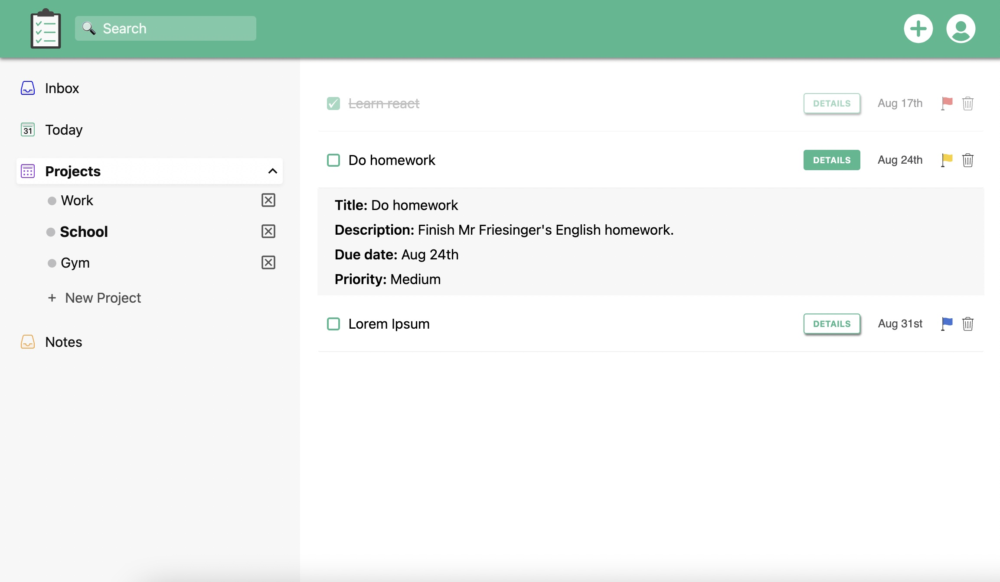

# todo-list

> - [Live Demo](https://hardroof.github.io/todo-list/)

---

 

## About the project

Todo list app is a task management application that helps to manage your personal and professional productivity. Its data is stored in localStorage.
  

## Technologies used

 &emsp;  &emsp; <a href="https://developer.mozilla.org/en-US/docs/Web/JavaScript" target="_blank" rel="noreferrer">  &emsp; </a>
  

## Contributing

Feedbacks, issues, and feature requests are welcome!
  

## Resources used

- Images by <a href='https://iconpacks.net'>Iconpacks</a>
